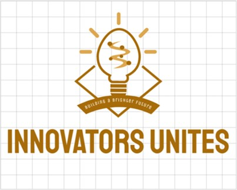
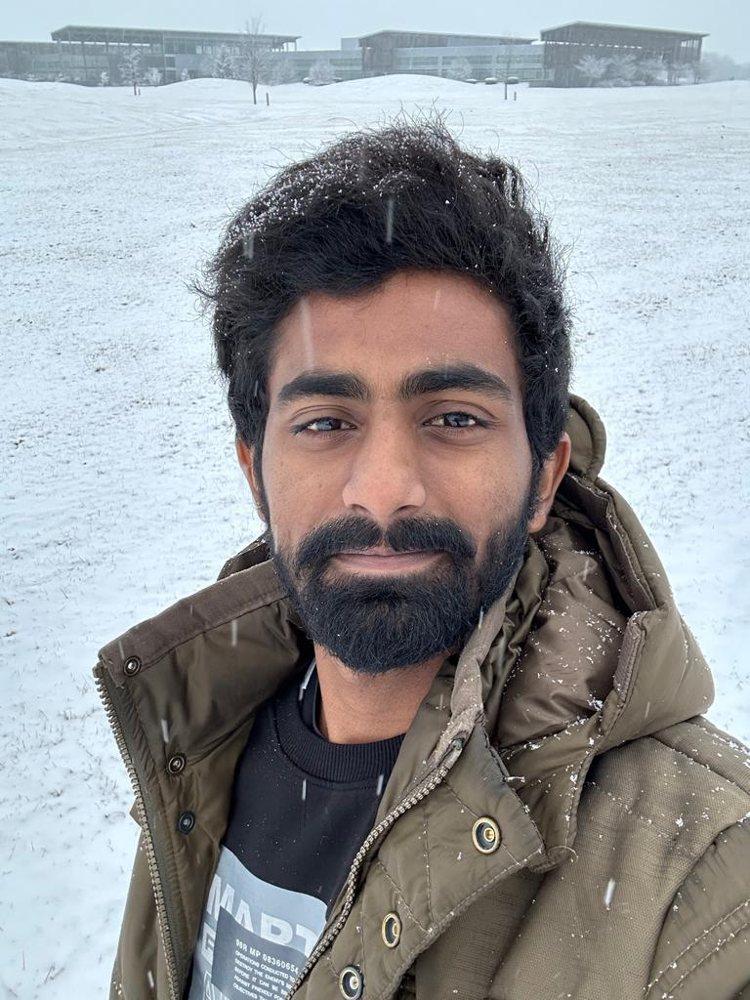

# PM-05SUM23-GROUP02

# SmartSecure

## Project
   <strong>Project Title   :   </strong> SmartSecure  
   <strong>Team Name       :   </strong> Innovators Unites  
   <strong>Logo            :   
    &nbsp;&nbsp;&nbsp;&nbsp;&nbsp;&nbsp;&nbsp;&nbsp; &nbsp;&nbsp;&nbsp;&nbsp;      
       </strong>  
    
## Team Members

   [Poorna Chandan Reddy Vavilala](https://github.com/chandan-vavilala)  
 [Sai Prashanth Volete](https://github.com/s559234)  
     [Ashok Chirumamilla](https://github.com/ashok-gitrepos)  
  [Annam Ribkarani](https://github.com/ribkaraniannam)  
 [Sumanasri Paila](https://github.com/Sumanareddy13)                 
  [Ashwanth Reddy Cheemarla](https://github.com/AshwanthS559214)  

                

 
## Participants
|     Team Member               | Role              | 
| -------------                 |:-------------:    |
| Poorna Chandan Reddy Vavilala | Project Mangaer   | 
| Sai Prashanth Volete          | Senior Software Engineer | 
| Ashok Chirumamilla            | Scrum Master     |  
| Sumanasri Paila               | HR |
| Annam Ribkarani               | Business Analyst   | 
| Ashwanth Reddy Cheemarla      | Tester |

## Key Contributions
<li>Poorna Chandan Reddy Vavilala is Project Managaer Leading the project </li>
<li>Sai Prashanth Volete will be Senior Software Engineer and will be managing Updates </li>
<li>Ashok Chirumamilla will be Scrum Master in the team</li>
<li>Sumanasri Paila will be HR in the team</li>
<li>Annam Ribkarani will be Business Analyst in the team</li>
<li>Ashwanth Reddy Cheemarla will be Tester in the team</li>

## Content Summary

[Click here](Summary.md) to view the content summary for the project

## Group Plan

> Requirement Analysis
* In this group we are deciding the project and gaining basic information to develop the project.
* We find the similar implemenation for the web applications.

> Planning
* We are analysing the total budget for this project development.
* Gathering the required staff for this project
* Dividing the work to develop
* Deciding which platform to implement and work.

> Execution
* In this stage we are developing the code for the project.
* And implemeting some testcases
* Deploy the first version of project

> Testing
* We are running the code with all possible testcases 
* If need any changes in our code, we will implement those modules again and test.
* Deploy the second version of project
* If everything is correct, Will do documentation for the Project and Plan for Release.

> Deployment
* Deploy the final version of project

   
